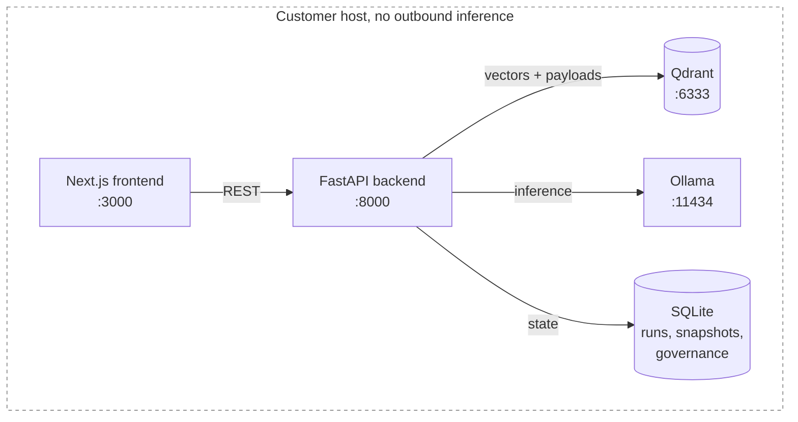
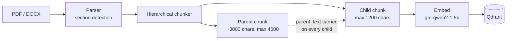
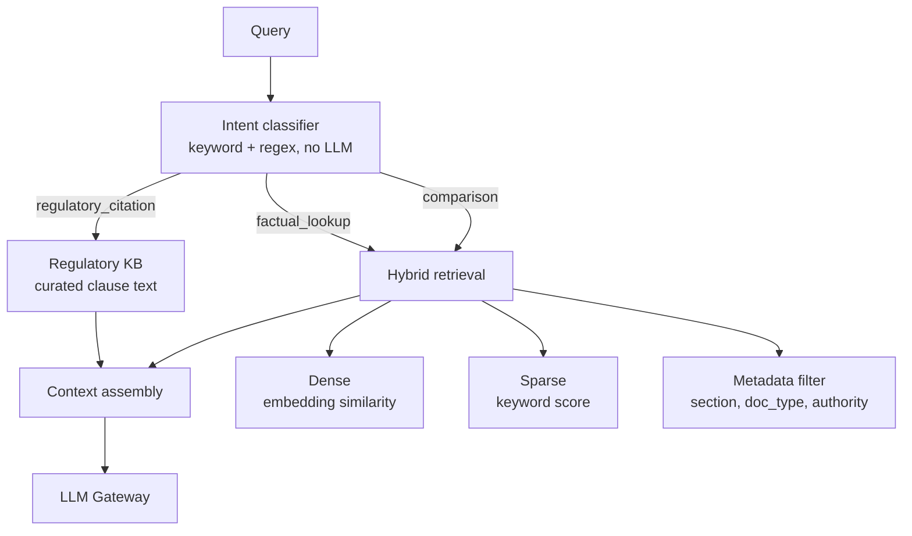
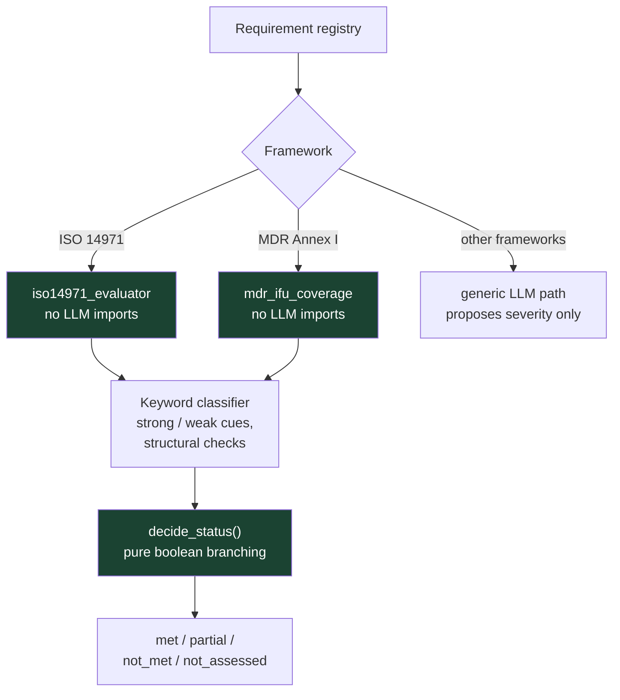
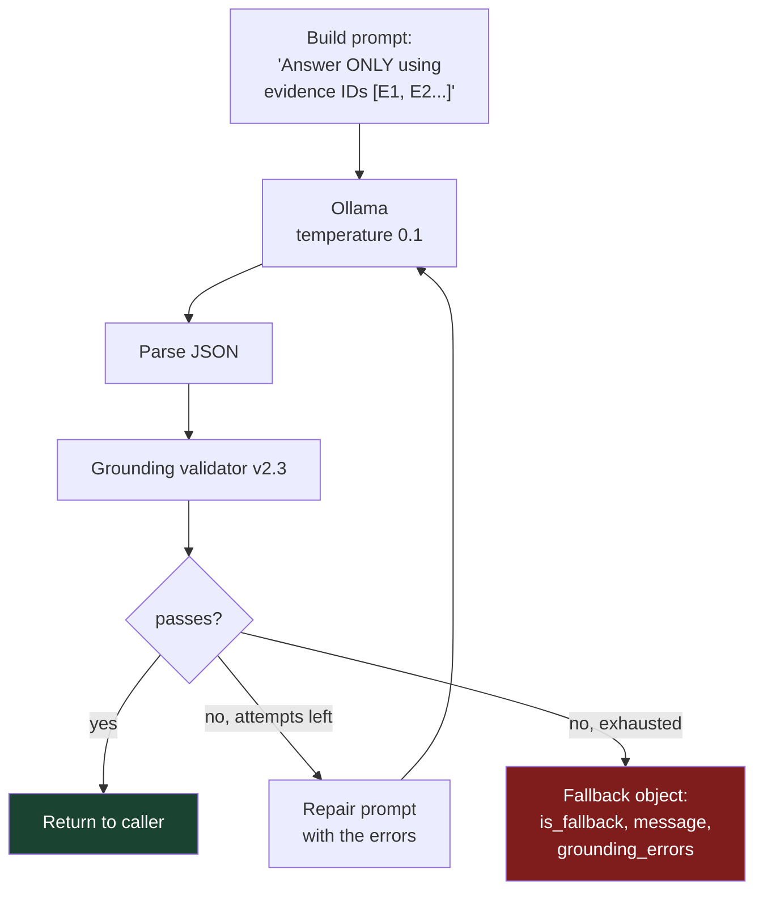
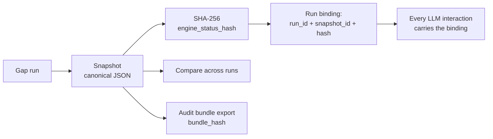

# Architecture

Four subsystems: ingestion, retrieval, the gap engine, and the LLM gateway. The
boundary that matters most is between the gap engine, which decides, and the
gateway, which explains. They do not overlap.

## System topology

No component reaches the public internet at inference time. There is no hosted
model client in the dependency tree, so the guarantee is enforced by absence
rather than configuration.

## Ingestion

Chunking is structural, not fixed-width. Documents split at detected section
boundaries, and each chunk carries the hierarchy it came from: `section_path`,
`section_title`, `section_number`, `semantic_label`, `chunk_type`, `parent_id`,
`chunk_index`, `page_span`.

Parent and child are stored together. Retrieval matches against the small child
chunk for precision, then hands the model the parent text for context. This is
why a match on a two-line clause still arrives with the surrounding section
attached.

Scanned PDFs route through a vision model. Extraction quality on poor scans is
not guaranteed and is not measured; see [`06-evals.md`](06-evals.md).

## Retrieval

Hybrid, with an intent classifier in front of it.

The intent classifier is deterministic: keyword and regex only, no model call. It
decides retrieval strategy before any inference happens.

When intent is `regulatory_citation`, curated regulatory text is injected as a
distinct `[Regulatory Reference]` block. The model can then separate *what the
regulation requires* from *what the customer's document says*, which are
different claims that must not blur together in an audit context.

## Gap engine

This is where decisions are made, and no LLM participates.

`decide_status()` takes booleans and returns a status. Given the same evidence it
returns the same answer, every time, with no temperature and no sampling.

The scoping is honest and worth stating plainly: for ISO 14971 and MDR Annex I
the evaluators contain no LLM calls at all. Other frameworks route through a
schema-agnostic path where the model proposes a finding severity. In no case does
model output write a coverage status, verdict, or `met` field. That boundary is
absolute across the system.

## LLM Gateway

The gateway's job is to make ungrounded output unreachable, not to flag it.

The validator checks schema, verbatim quotes against their span, field
references, citation IDs existing in the evidence index, summary factuality, and
numbers appearing in a `FieldReference` or an allowed aggregate.

On failure the gateway retries with a repair prompt carrying the specific errors,
up to `MAX_RETRIES = 2`, so three attempts total. If all fail it returns a
fallback object containing only `is_fallback`, a message, and the grounding
errors.

**The ungrounded model text is discarded.** It is not returned, not attached, not
logged into the response. That is the difference between blocking and flagging,
and it is the reason the grounding claim survives scrutiny.

Deterministic query types, `STATUS`, `LIST`, `SUMMARY`, and `COMPARE`, bypass the
model entirely and are answered from snapshot data.

## State and snapshots

Snapshots are written through a single append-only path. There is no update or
delete. The hash uses `json.dumps(payload, sort_keys=True)` with SHA-256, and
bundle hashes use the blank-the-field-then-hash pattern so the hash covers the
payload it is stored in.

Two limits, stated because they are easy to overclaim: the hash is a **provenance
stamp**, binding an interaction to an engine state, not a tamper check, because
nothing recomputes and compares it. And append-only is enforced by there being
one write path, not by a database constraint.

Snapshot replay is not implemented. Compare and export are.
