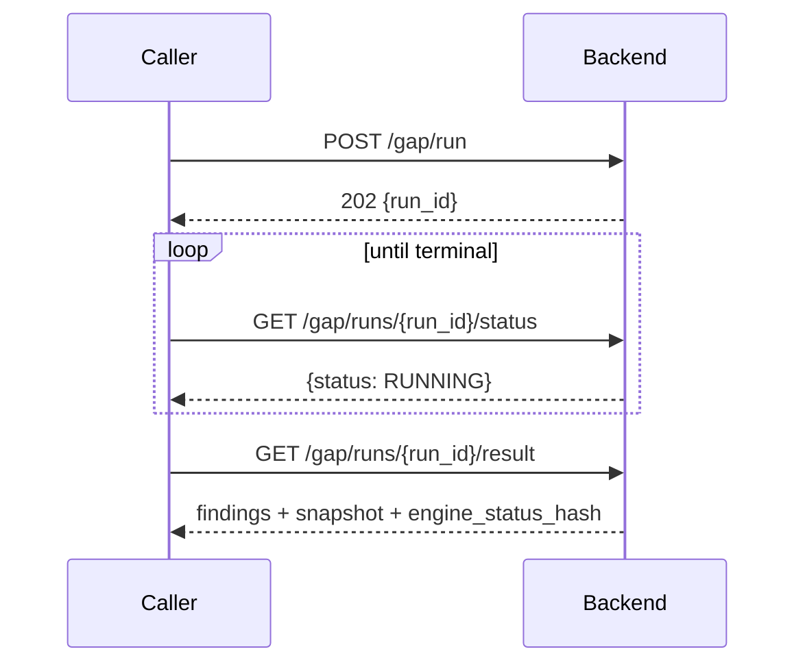

# Integration contracts

The API surface, the shapes that cross it, and what the guarantees mean for a
caller. Everything is versioned at `/api/v1/`. Interactive schema is served at
`/docs` on the running backend.

## Surface

```
POST   /api/v1/documents/upload             Upload documents
POST   /api/v1/ingestion/ingest/{doc_id}    Ingest into vector store

POST   /api/v1/chat/query                   RAG query
GET    /api/v1/chat/history                 Conversation history

POST   /api/v1/gap/run                      Start gap run
GET    /api/v1/gap/runs/{run_id}/status     Poll status
GET    /api/v1/gap/runs/{run_id}/result     Results and snapshot
POST   /api/v1/gap/advanced/run             Start advanced gap run
GET    /api/v1/gap/advanced/{run_id}/status

POST   /api/v1/intelligence/explain         Explain evidence for a requirement
POST   /api/v1/intelligence/copilot/query   Grounded copilot query
POST   /api/v1/intelligence/draft           Draft from template
GET    /api/v1/intelligence/review-queue    Pending review items

GET    /api/v1/portfolio/compare            Compare two runs
GET    /api/v1/portfolio/timeline/{product} Compliance timeline

GET    /api/v1/program/risk-register        Cross-product risk register
GET    /api/v1/program/root-cause/{req_id}  Root cause analysis
GET    /api/v1/program/remediation/{req_id} Remediation playbook

POST   /api/v1/impact/analyze               Change impact simulation
POST   /api/v1/scenarios/simulate           Scenario simulation

GET    /api/v1/gates/summary/{run_id}       Gate status
POST   /api/v1/gates/evaluate/{run_id}      Evaluate gates

GET    /api/v1/meta/health                  Health check
GET    /api/v1/meta/version                 Engine version
```

## Health

The contract the orchestrator depends on.

```json
{
  "status": "ok",
  "components": {
    "backend": "ok",
    "vectorStore": "ok",
    "ollama": "ok"
  },
  "engineVersion": {
    "systemVersion": "0.3.3",
    "apiVersion": "v1",
    "indexSchemaVersion": 2,
    "embeddingModelId": "rjmalagon/gte-qwen2-1.5b-instruct-embed-f16",
    "llmModelId": "qwen2.5:7b-instruct-fixed"
  }
}
```

`components` reports dependencies separately, so a degraded stack is
distinguishable from a dead one. `indexSchemaVersion` matters on upgrade: a
change means the vector store must be reindexed, and
[`07-runbook.md`](07-runbook.md) covers that path.

Note that healthchecks inside the compose file deliberately avoid `curl`, which
none of the base images ship. See [`05-failure-modes.md`](05-failure-modes.md).

## Run lifecycle

Gap runs are asynchronous. Start, poll, fetch.



Concurrency is capped per tenant, `GAP_MAX_CONCURRENT_RUNS_PER_TENANT`, default
1. Exceeding it is rejected rather than queued indefinitely.

## Coverage status

The central enum. Four values, deliberately not two.

| Value | Meaning |
|---|---|
| `met` | Evidence found and classified sufficient |
| `partial` | Evidence found but quality assessed low |
| `not_met` | Searched, and absent |
| `not_assessed` | Out of scope, or the standard carries no expectation here |

`not_met` and `not_assessed` are different answers and must not be collapsed by a
consumer. One is a finding requiring action; the other means the requirement does
not apply. See [ADR-006](03-decisions.md).

This value is always produced by deterministic logic. No model output writes it.

## Grounded output

Every AI-generated payload is one of two shapes, and callers must handle both.

**Grounded:**

```json
{
  "answer": "...",
  "citations": [
    {"run_id": "...", "span_id": "...", "section_title": "...", "quote": "..."}
  ],
  "grounded_claims": [
    {"claim_text": "...", "field_references": ["..."]}
  ]
}
```

**Fallback**, returned when grounding could not be achieved in three attempts:

```json
{
  "is_fallback": true,
  "message": "AI could not produce a grounded response",
  "grounding_errors": ["..."]
}
```

The fallback carries **no model text**. Ungrounded output is discarded rather
than attached with a warning, so a caller cannot render it by accident. Check
`is_fallback` before reading `answer`.

## Snapshot and run binding

Results carry a binding that ties them to the exact engine state that produced
them:

```
run_id + snapshot_id + engine_status_hash
```

`engine_status_hash` is SHA-256 over canonically serialised payload
(`json.dumps(..., sort_keys=True)`). Every LLM interaction logged against a run
carries the same binding, so an explanation can always be traced to the engine
state it described.

Audit bundles add `integrity.bundle_hash`, computed with the hash field blanked
first so the hash covers the payload it is embedded in.

**What this does not give you.** The hash is a provenance stamp, not tamper
detection. Nothing recomputes and compares it. Do not present it to an auditor as
proof the record is unaltered.

## Errors

Standard HTTP semantics.

| Code | Meaning |
|---|---|
| 400 | Malformed request or unsupported document type |
| 401 | `GAP_API_KEY` set and missing or wrong |
| 404 | Unknown `run_id`, `doc_id`, or requirement |
| 409 | Concurrency limit reached for tenant |
| 422 | Schema validation failure, FastAPI shape |
| 500 | Unhandled server error |
| 503 | Qdrant or Ollama unreachable |

503 is the one to handle deliberately. It means a dependency is down rather than
the request being wrong, and retrying the same request after the dependency
recovers is correct. Check `/meta/health` to see which component failed.

A grounding failure is **not** an error code. It returns 200 with the fallback
body, because the request was processed correctly and the honest answer is that no
grounded response could be produced.

## Authentication

`GAP_API_KEY` is optional and unset by default, appropriate for a single-tenant
network-isolated install. Set it to require a key on gap endpoints. There is no
user-level authentication or RBAC in the API; the deployment boundary is the
security boundary. See [`08-handoff.md`](08-handoff.md).

## Compatibility

`apiVersion` is `v1` and paths are versioned. `indexSchemaVersion` is separate and
tracks the vector store layout; it can change without an API change and requires
reindexing when it does. Model IDs are reported in `/meta/version` because a model
change alters output even when no code changed, which matters when reproducing a
historical result.
